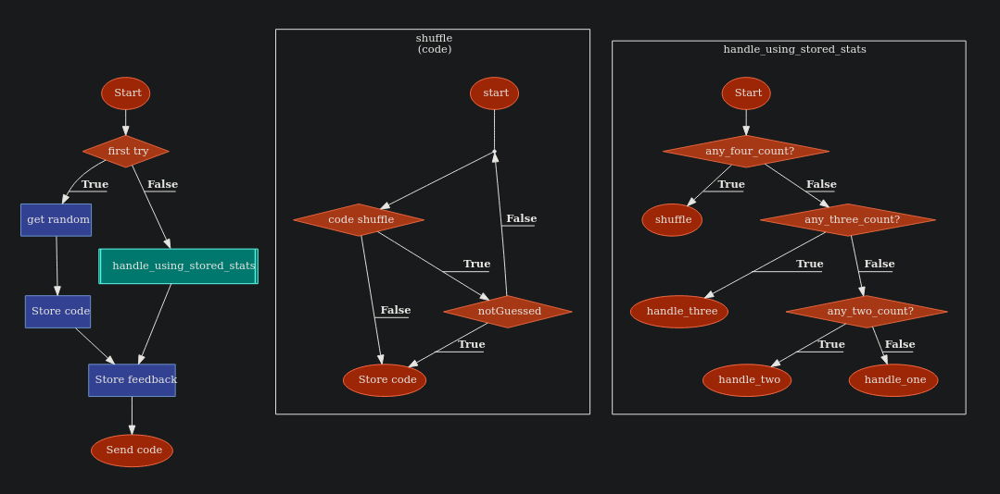

# About
- Play mastermind in terminal.
- Mastermind is a color code guessing game.
  - You have to guess correct code while not running out of guesses.

# Features
- Harder difficulty.
  - 7 different colors.
  - can not repeat same colors.
- Both Computer and Player can play as guesser\mastermind(who puts secret code).
- Custom algorithm for computer guess.
- Colorized output.
- Feedback on guesses.
  - number of balls with wrong position but right colors.
  - number of balls with right position and right colors.

# Peek
Computer Guess Algorithm - (for non repeating colors and 7 total colors)

demo -

original link -

[Click me!](https://discord.com/channels/505093832157691914/1290407819903893587/1290407819903893587)